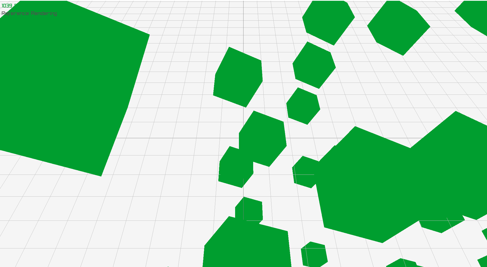

https://novaleaf.itch.io/notnot-engine/devlog/313092/towards-a-render-system

# Towards a render system
The basic outline of the rendering system in in place.  

Rendering takes place on it's own dedicated thread.  Preparation  of data sent to rendering occurs in the multithreaded `SimPipeline`.

## A basic workflow

The first part was to make rendering read components such as WorldXform, and render that in a dedicated render thread, seperate from the rest of the engine.


That went well.  The `EntityQuery` worked as designed and making a system to "move" the box was easy enough.

```cs
public class TestMoveSystem : NotNot.Ecs.System
{
	EntityQuery moveQuery;
	protected override void OnInitialize()
	{
		base.OnInitialize();
		moveQuery = entityManager.Query(new() { all = {typeof(WorldXform) } });
		//notify our need for read/write access so systems can be multithreaded safely
		RegisterWriteLock<WorldXform>();
	}

	protected override async Task OnUpdate(Frame frame)
	{
		//run the query, selecting all entities and doing work on them.
		moveQuery.Run((
			//metadata about the entity
			ReadMem<EntityMetadata> meta,
			//write access to Translation component
			Mem<WorldXform> transforms
			) =>
		{
			var elapsed = (float)frame._stats._wallTime.TotalSeconds * 2;

			for (var i = 0; i < meta.length; i++)
			{
				//apply test move
				transforms[i].Position = new Vector3(MathF.Sin(elapsed), 0f, MathF.Cos(elapsed));
				transforms[i].Rotation = Quaternion.CreateFromYawPitchRoll(0, 0, elapsed);
				transforms[i].Scale = Vector3.One * MathF.Cos(elapsed);
			}
		});
	}
}
```

The rendering of the component `WorldXform` was a bit trickier though.  A pretty thorough intra-system data synchronization system had to be considered.  The workflow arrived at was to:
1. A `RenderPacketSystem` Creating a `RenderPacket`, an array of all entity `WorldXform`
2. those RenderPackets enqueued into a `StateSync` collection, that locks all execution at the start of every frame and sends the `RenderPacket`'s to the Render Worker thread.
3. The render thread simply burns through through all RenderPackets, rendering their contents.

## Designing a flexible pipeline

The next step was to get batched rendering working with custom assets, assigned in a "normal" way (previously the red box was hard coded).

The biggest pain was figuring out how to abstract render techniques away from the engine.   I ended up making a workflow out of things I am calling `RenderDescription` that is made of one or more `RenderTechnique`, with the above vid showing a 3dModel technique.

Here is how I set up my render pipeline's "Application Stage".  

1) a culling system marks what game objects are visible.  these are passed to the next step
2) gameObjects are sorted according to their associated `RenderDescription`
3) a `RenderDescription` is made of one or more `Techniques`
4) a `BatchedModel` is a `Technique` .  example:  The gameObjects with the same `BatchedModel(mesh,material)` have their world xforms coppied to a `RenderPacket` array 
5) `RenderPacket+Technique` is sent to the render thread.
6) render thread draws each item in the  `RenderPacket` according to instructions in the `Technique`



Using ecs, all entities that use the same 3dModel are batched.  in the above example, all these entities share the same green cube `Mesh+Material`

Here is the  code I used to draw the above green boxes, though keep in mind this doesn't include the System that does the moving, just the "game script".  The `TestMoveSystem` snippet further up gives a good example of what the moving system looks like.


```cs
global using NotNot;
using NotNot.Bcl;
using NotNot.Ecs;
using NotNot.Rendering;
using Raylib_cs;
using System.Threading.Tasks;

//create basic engine
var engine = new Engine();
engine.Initialize();
//add renderer
engine.Rendering.AddChild(new NotNot.Rendering.RenderReferenceImplementationSystem());
//add system to apply movement (to worldXform)
engine.DefaultWorld.Phase2_Simulation.AddChild(new MoveSystem());
//add a system to simulate input (provide movement)
engine.DefaultWorld.Phase2_Simulation.AddChild(new TestInputSystem());
//add system to generate render packets
engine.DefaultWorld.Phase2_Simulation.AddChild(new RenderPacketGenerationSystem());

//start
engine.Updater.Start();

//create a box mesh+material used for rendering
var boxModel = new BatchedModelTechnique();
//init gfx via a callback.  this is needed because opengl only runs single threaded
boxModel.OnInitialize=(_this)=>
{
	_this.mesh = Raylib.GenMeshCube(1, 1, 1);
	_this.material = Raylib.LoadMaterialDefault();
	unsafe
	{
		boxModel.material.maps._As<MaterialMap>()[(int)MaterialMapIndex.MATERIAL_MAP_DIFFUSE].color = Color.LIME;
	}
};
var renderDescription = new RenderDescription() { techniques = { boxModel } };

//create an archetype
var em = engine.DefaultWorld.entityManager;
var archetype = em.GetOrCreateArchetype(new()
{
	typeof(WorldXform),
	typeof(IsVisible),
	typeof(Move),
	typeof(TestInput),
});

//create sharedComponents used used to bucket entities with
var sharedComponents = SharedComponentGroup.GetOrCreate(renderDescription);

//create entities using the sharedComponent
em.EnqueueCreateEntity(100, archetype, sharedComponents, (args) =>
{
	var (accessTokens, entityHandles, archetype) = args;
	foreach (var token in accessTokens)
	{
		ref var xform = ref token.GetComponentWriteRef<WorldXform>();
		xform = new WorldXform(){Position=__.Rand._NextVector3()*10};
	}
});

await Task.WhenAny(engine.RunningTask, Task.Delay(100000000));
await engine.Updater.Stop();
```
Overall I am pretty happy at how clean things are at this stage, and how simple it is to use.

Any feedback would be appreciated.  If you happen to know of any literature describing render system workflows, I would love to read that too.
